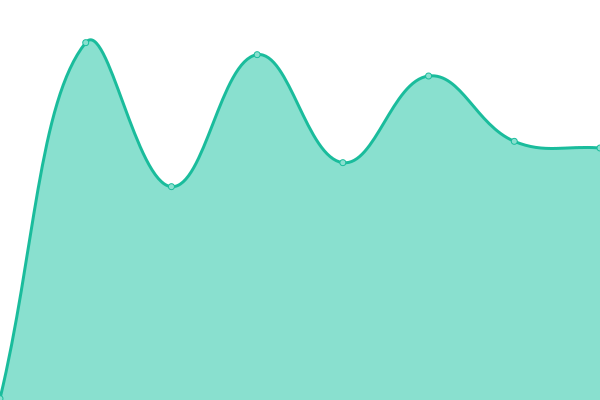

# [📈 Live Status](https://SharafatKarim.github.io/uptime): <!--live status--> **🟩 All systems operational**

This repository contains the open-source uptime monitor and status page for [Sharafat](https://sharafat.pages.dev/), powered by [Upptime](https://github.com/upptime/upptime).

With [Upptime](https://upptime.js.org), you can get your own unlimited and free uptime monitor and status page, powered entirely by a GitHub repository. We use [Issues](https://github.com/SharafatKarim/uptime/issues) as incident reports, [Actions](https://github.com/SharafatKarim/uptime/actions) as uptime monitors, and [Pages](https://SharafatKarim.github.io/uptime) for the status page.

<!--start: status pages-->
<!-- This summary is generated by Upptime (https://github.com/upptime/upptime) -->
<!-- Do not edit this manually, your changes will be overwritten -->
<!-- prettier-ignore -->
| URL | Status | History | Response Time | Uptime |
| --- | ------ | ------- | ------------- | ------ |
|  [SharafatKarim | Blog](https://sharafat.pages.dev/) | 🟩 Up | [sharafat-karim-blog.yml](https://github.com/SharafatKarim/uptime/commits/HEAD/history/sharafat-karim-blog.yml) | 

 119ms
     
 | 

<a href="https://SharafatKarim.github.io/uptime/history/sharafat-karim-blog">0.00%</a>
    

|  [Sharafat's Notes](https://sharafat.vercel.app/) | 🟩 Up | [sharafat-s-notes.yml](https://github.com/SharafatKarim/uptime/commits/HEAD/history/sharafat-s-notes.yml) | 

 154ms
     
 | 

<a href="https://SharafatKarim.github.io/uptime/history/sharafat-s-notes">100.00%</a>
    

|  [Linux Headlines](https://sharafatkarim.github.io/LinuxHeadlines/) | 🟩 Up | [linux-headlines.yml](https://github.com/SharafatKarim/uptime/commits/HEAD/history/linux-headlines.yml) | 

 146ms
     
 | 

<a href="https://SharafatKarim.github.io/uptime/history/linux-headlines">100.00%</a>
    

|  [SharafatKarim | Legacy Site](https://sharafatkarim.github.io/legacy-site/) | 🟩 Up | [sharafat-karim-legacy-site.yml](https://github.com/SharafatKarim/uptime/commits/HEAD/history/sharafat-karim-legacy-site.yml) | 

 24ms
     
 | 

<a href="https://SharafatKarim.github.io/uptime/history/sharafat-karim-legacy-site">100.00%</a>
    

<!--end: status pages-->

[**Visit our status website →**](https://SharafatKarim.github.io/uptime)

## 📄 License

- Powered by: [Upptime](https://github.com/upptime/upptime)
- Code: [MIT](./LICENSE) © [Sharafat](https://sharafat.pages.dev/)
- Data in the `./history` directory: [Open Database License](https://opendatacommons.org/licenses/odbl/1-0/)
